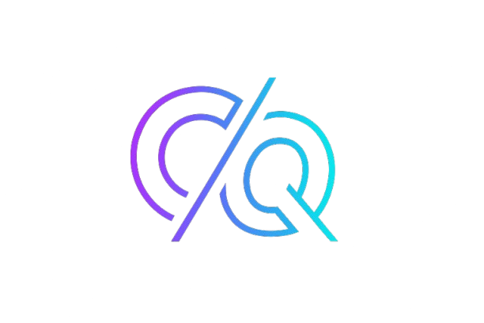

---
hide:
  - navigation
---

  
  <h1>CuttingQueues</h1>
  
<em>100 brutal queue experiments for distributed sanity</em>

---

# 🧠 CuttingQueues

> *A brutalist’s field manual to mastering Celery, Redis, and distributed queues — one failure at a time.*

Welcome to **CuttingQueues**, an open engineering journey by [Venugopalan Iyengar](https://github.com/Venugopalan26).

This project contains **100 experiments** in Celery and Redis that systematically build your understanding of:
- Queue fairness
- Fault tolerance
- Worker orchestration
- Tail latency control
- Metrics, telemetry, and reliability

Each task is a *self-contained experiment* — with source code, failure reports, metrics, and a distilled insight.

---

## 🧩 How to Use
- Start from **Task #1** — Prefork vs Solo.
- Run each experiment locally using `docker-compose up`.
- Observe metrics on Prometheus & Grafana.
- Read each task’s analysis under `/docs/100_tasks/`.

---

## ⚡ Stack
- Python 3.11+
- Celery 5.3+
- Redis 7.x (Standalone & Streams)
- Prometheus + Grafana + Sentry
- Docker Compose

---

## 💬 Philosophy
> "Every queue hides a truth about your system’s pain."  
> *CuttingQueues* is not just a guide — it’s a debugging philosophy.

---
